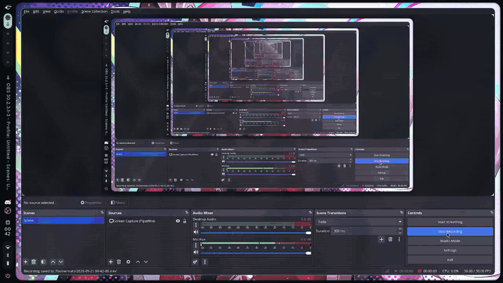

# Linux dotfiles for Debian, Ubuntu, Arch, Fedora and openSUSE: zsh, tmux, Neovim, Ghostty and Hyprland in one command

[](https://github.com/rhmatzeka/dotfile/actions/workflows/ci.yml)
[](LICENSE)


A one-command **Linux dotfiles installer** (Debian/Ubuntu, Arch, Fedora, openSUSE) for a fast terminal and an optional **Hyprland** desktop with the
**Caelestia** shell. It sets up **zsh** (Oh My Zsh, starship), **tmux**, **Neovim** with **NvChad** (tree-sitter, LSP),
**Ghostty**, terminal browsers (Browsh, elinks, w3m) and a Dracula + cyan theme. Nothing is overwritten without a
backup, and everything can be undone.

```bash
bash <(curl -fsSL https://dotfiles.rahmateka.my.id)
```

## Preview



[Watch the full-quality video (mp4)](docs/preview.mp4)

## Install

Use `bash <(...)` rather than `curl | bash`: it keeps your terminal attached, so the menu and the `sudo` password
prompt work. **Read a script before you run it.** You can look at this one first:

```bash
curl -fsSL https://dotfiles.rahmateka.my.id | less
```

Every step can be rehearsed without changing anything:

```bash
bash <(curl -fsSL https://dotfiles.rahmateka.my.id) --dry-run --all
```

The short domain redirects to the script in this repository (see [docs/short-domain.md](docs/short-domain.md)). If it
ever fails, the same script is at
`https://raw.githubusercontent.com/rhmatzeka/dotfile/main/install.sh`.

## What you get

| Component | Contents |
|---|---|
| `base` | Base packages (git, fzf, ripgrep, eza, zoxide, ...), the JetBrainsMono Nerd Font, and makes sure your Downloads folder exists |
| `shell` | zsh, Oh My Zsh (autosuggestions, syntax highlighting) and the starship prompt |
| `tmux` | tmux with a cyan / Dracula theme |
| `nvim` | Neovim + NvChad, tree-sitter parsers (html, css, js, php, ...) and LSP servers through Mason |
| `terminal` | Ghostty config: dark theme, Vim-style keys |
| `browsers` | Terminal browsers: Browsh (Firefox in the terminal), elinks, w3m. Files you download in elinks and Browsh are saved to your Downloads folder instead of the current directory |
| `apps` | Microsoft 365 web apps (Word, Excel, PowerPoint, Outlook, OneDrive) in their own windows, plus **Open with Microsoft 365** for local files (converts PDFs to .docx, uploads the file to a private folder of your OneDrive through the Microsoft Graph API, using rclone only for the sign-in, then opens it on the web). Double-clicking Word/Excel/PowerPoint files does this; for PDFs (which stay in your PDF viewer by default) use the Thunar right-click entry **Open with Microsoft 365**, PDF viewer, VLC, GIMP. Pre-selected only when a graphical session is running |
| `web` | Web development: PHP, Composer, MariaDB, Apache, phpMyAdmin. Services are **not** started unless you say yes (Apache listens on port 80); no passwords are set |
| `rust` | Rust through the official rustup installer: stable toolchain, clippy, rustfmt, rust-analyzer |
| `desktop` | Hyprland + Caelestia shell (with two small patches: the Bluetooth panel hides devices that only show a MAC address and lists audio devices first; notifications that contain HTML, such as Instagram's, show clean text), plus Caelestia's btop, fastfetch, foot, micro, thunar, zed and fish configs (only where you have none). **Debian 13 only, beta.** Builds Qt 6.11 from source (1 to 2 hours) |

The default selection is everything except `desktop`.

## Supported systems

| System | Status |
|---|---|
| Debian 13 (trixie) | All components except `desktop` installed and checked **from scratch in a clean Debian 13**. `desktop`: the package lists are validated; the source build has not been re-run through this script yet (beta) |
| Ubuntu 24.04 LTS, 26.04 LTS | Same components installed and checked from scratch in a clean Ubuntu (earlier revision of the installer). `starship` is not in the 24.04 repositories, so its official installer is used; Browsh is skipped (no `firefox-esr` package) while elinks and w3m are installed |
| Arch Linux (and Manjaro, EndeavourOS, ... via `ID_LIKE=arch`) | Installed and checked from scratch in the official Arch bootstrap image. Only Arch itself was tested. `web` and `rust`: package names checked against the repositories, full run **not completed yet** |
| Fedora 44 (and RHEL-likes via `ID_LIKE`) | Installed and checked from scratch in the official Fedora container image. `starship` is not in the Fedora repositories: its official installer is used. Only Fedora itself was tested. `web` and `rust`: package names checked, full run **not completed yet** |
| openSUSE Tumbleweed | Installed and checked from scratch in the official Tumbleweed image. Leap and SLE were not tested. `web` and `rust`: package names checked, full run **not completed yet** |
| Alpine, NixOS, Void, Gentoo, macOS | **Not supported.** Contributions are welcome (see below) |

`desktop` (Hyprland + Caelestia) is **Debian 13 only** because it depends on `trixie-backports` and on pinned build
versions. On the other distributions it is not offered; install Hyprland from your repositories and follow
[caelestia-dots/caelestia](https://github.com/caelestia-dots/caelestia).

On **Arch**, keep the system up to date (`sudo pacman -Syu`) before running the installer: it installs with
`pacman -S --needed` and does not refresh the package database itself, to avoid a partial upgrade.

Ghostty has no package on Debian, Ubuntu, Fedora or openSUSE: only its config is installed there. On Arch it is
installed from the repositories when available.

### How this was tested

- Real installs into **clean root filesystems** (official images, run in `systemd-nspawn`) as a normal user with the
  final version of the installer: Debian 13, Arch, Fedora 44 and openSUSE Tumbleweed with every component except
  `desktop`, then inspected: tool versions, fonts, Neovim with 18 tree-sitter parsers and 7 Mason packages, the Microsoft
  365 launchers, and `uninstall` (14 links removed each time). Ubuntu 24.04 and 26.04 were verified the same way with
  the previous Debian-only revision. Repeat it yourself with `tests/clean-rootfs.sh` (see below).
- A user who **already has their own config files**: they are backed up, a second install does not back them up
  again, and `uninstall` puts the originals back.
- `--dry-run` for every component, shellcheck, and a GitHub Actions run on Ubuntu for every push.
- Failures are not swallowed: a failed package step fails its component and the installer exits non-zero.

**Not tested:** "Open with Microsoft 365" with a work or school (Microsoft 365 Business) account (it was tested end to end with one personal account: PDF converted, uploaded and opened), `web` and `rust` end to end on Arch, Fedora and openSUSE (they were on Debian 13), the extra Caelestia application configs installed by `desktop`, the `desktop` source build from scratch, the Microsoft 365 web apps opening in a real browser
(the launchers and the installer were tested, not a login), Ghostty itself, any distribution or release not listed
above, and ARM machines.

## Usage

```bash
./install.sh                    # interactive menu
./install.sh --all              # every component, including desktop
./install.sh --only shell,nvim  # pick components
./install.sh --dry-run --all    # show what would happen, change nothing
./install.sh --yes              # no questions, use the default answers
./install.sh --list             # list the components
```

Through `curl`, put the options after the command, for example
`bash <(curl -fsSL <url>) --only shell,tmux`.

## Safety

- A file that would be replaced is **moved** to `~/.dotfiles-backup/<timestamp>/`, never overwritten.
- Every symlink it creates is recorded, so `uninstall` only undoes what this installer did.
- `sudo` is used only to install packages and, for `desktop`, to write under `/opt` and `/usr/local`.
- Run it as a normal user, not as root.

## Uninstall

```bash
bash <(curl -fsSL https://dotfiles.rahmateka.my.id/uninstall.sh)
```

The links are removed and your original files come back. Packages, fonts, Oh My Zsh and anything built under `/opt`
are left in place; the list is printed at the end.

## How it works

The top-level `install.sh` detects the OS, fetches this repository to `~/.local/share/rhmatzeka-dotfile`, and hands over to the installer for
that platform (`linux/install.sh`, which uses `lib/pkg.sh` to talk to apt, pacman, dnf or zypper). Configs live in `config/` and are installed as symlinks, so editing them
in that directory takes effect immediately. Shared helpers (backup, symlinks, dry run) are in `lib/common.sh`.

```
install.sh  uninstall.sh        entry points (OS detection)
lib/common.sh  lib/pkg.sh        shared helpers; pkg.sh maps package names per distribution
linux/                          installer for every family: install.sh, uninstall.sh
linux/debian/desktop.sh         Hyprland + Caelestia build (Debian 13 only)
config/                         zsh, starship, tmux, nvim, ghostty, elinks, caelestia
bin/                            small scripts (web, firefox-for-browsh)
docs/                           preview placeholder, how-tos
tests/clean-rootfs.sh           install into a clean Debian/Ubuntu/Arch/Fedora/openSUSE root filesystem and check it
```

## Adding another distribution

Everything distribution-specific lives in `lib/pkg.sh`: a case in `pkg_detect` (which `ID`/`ID_LIKE` belongs to which
family), and in `pm_is_installed`, `pm_install` and `pm_names` (the package names that differ). Add the same family to
the detection in the top-level `install.sh`. Use `pkg_need` / `pkg_optional` in components so `--dry-run` and backups
keep working. Pull requests are welcome; please say in the description which system you actually tested on.
`tests/clean-rootfs.sh <debian|ubuntu|arch|fedora|opensuse> <codename>` builds a minimal system, runs the installer in it
as a normal user and checks the result (needs `sudo` and `systemd-container`; `debootstrap` for Debian/Ubuntu, `zstd`
for Arch).

## Keywords

dotfiles, Linux setup script, Debian dotfiles, Ubuntu dotfiles, Arch Linux dotfiles, Fedora dotfiles, openSUSE dotfiles, one-line installer, Hyprland dotfiles, Hyprland rice,
Caelestia shell install, Wayland desktop, NvChad setup, Neovim config, zsh + starship + tmux, Ghostty config,
terminal browser, developer environment, unixporn.

## License and credits

The code in this repository is MIT licensed. The colour palette is [Dracula](https://draculatheme.com) (MIT) with a cyan
accent. These are downloaded during installation and are **not** redistributed here: Oh My Zsh (MIT), the NvChad starter
(Unlicense), Browsh (LGPL-2.1), quickshell and the Caelestia shell/CLI (GPL-3.0, built from source; the Bluetooth fix is shipped as a patch in `config/caelestia/patches/`, not as a copy of upstream files), and the Hyprland
configuration from `caelestia-dots/caelestia` (cloned from upstream).
